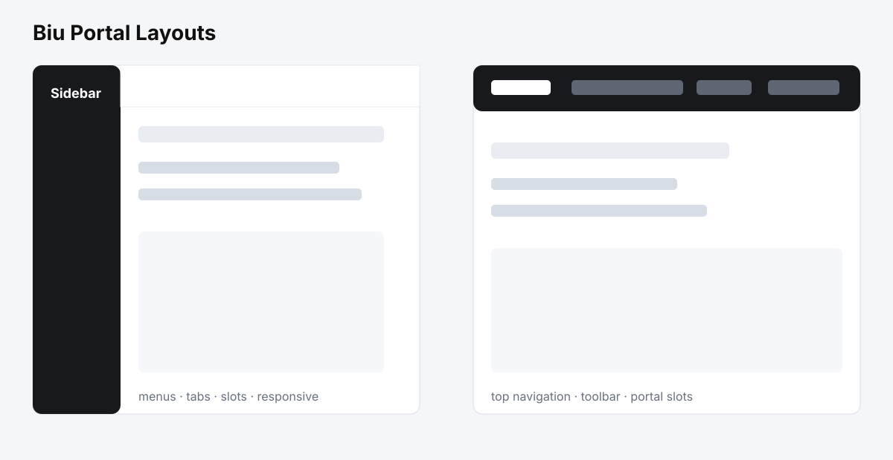
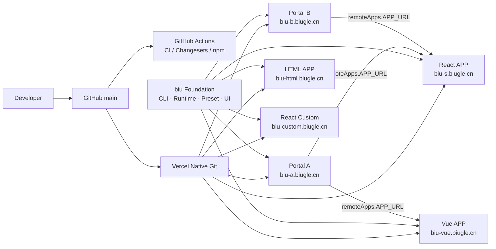

# biu


[中文 README](README.md)



> One sentence: biu is an enterprise frontend foundation for independently delivered Portals, APPs and React Custom projects, unifying Shell, hierarchical menu routing, isolated state, cross-window protocols and the complete engineering workflow.

> Slogan: biu biu once, generate an enterprise frontend foundation in one click.

biu is built on Node.js 22+, pnpm, TypeScript, Rsbuild/Rspack and modular `@biugle/*` packages. It provides the CLI, permission-aware compilation, Runtime, official Layouts and Adapter Contract. Business projects only maintain pages, portal configuration and local routes.

## Why biu

Enterprise teams often operate React, Vue, native HTML and legacy systems at the same time. biu decouples integration from the business framework:

- **New and legacy projects can coexist.** React uses the official Adapter. Vue, HTML and other technologies can integrate through the Adapter Contract, the bridge protocol or iframe without rewriting the business application.
- **Four delivery modes are supported:** Portal Sidebar, Portal Topbar, independent APP with an official preset, and independent React Custom. Portal and APP are peers with separate startup, builds, deployments and domains.
- **One team-wide contract.** Menus, complete hierarchical URLs, permissions, Tabs, Breadcrumbs, state, authentication boundaries, themes, locale, timezone, direction and cross-window communication share one standard.
- **Consistent UI behavior.** Message, Tooltip, Modal, Drawer, `fire()`, loading states, error boundaries and update notifications come from reusable public packages.
- **Progressive adoption.** Existing applications can start as iframe APPs and later move to an Adapter. The Portal consumes remote APP metadata and never bundles the APP source.
- **Auditable delivery.** CLI generation, Rsbuild builds, ESLint, Prettier, EditorConfig, Husky/lint-staged, Knip, Changesets and GitHub Actions form one repeatable workflow.

biu standardizes the platform shell and engineering process without forcing every business project to use the same UI framework.

## Production Demo topology

All production Demos use the same foundation. A Portal owns menu, routing and remote APP configuration; each independent APP is built, deployed and rolled back separately.



| Demo      | URL                                                  | Purpose                                                        |
| --------- | ---------------------------------------------------- | -------------------------------------------------------------- |
| Portal A  | [biu-a.biugle.cn](https://biu-a.biugle.cn)           | Sidebar Portal, menus, remote APPs and foundation capabilities |
| Portal B  | [biu-b.biugle.cn](https://biu-b.biugle.cn)           | Topbar Portal, multi-directory navigation and toolbar slots    |
| React APP | [biu-s.biugle.cn](https://biu-s.biugle.cn)           | Independent React APP                                          |
| Vue APP   | [biu-vue.biugle.cn](https://biu-vue.biugle.cn)       | Independent Vue 3 APP                                          |
| HTML APP  | [biu-html.biugle.cn](https://biu-html.biugle.cn)     | Native HTML APP                                                |
| Custom    | [biu-custom.biugle.cn](https://biu-custom.biugle.cn) | Independent React Custom mode                                  |

The domains become active after the Vercel Projects are linked. See the [Vercel deployment guide](docs/vercel-deploy.md).

## Technology stack

- Node.js 22+, pnpm and TypeScript
- Rsbuild/Rspack for development, production builds, code splitting and content-hashed assets
- React official Adapter; Vue 3 and native HTML demos; Svelte, Angular and other frameworks through the Adapter Contract
- Zustand through `@biugle/biu-store` for preferences, authentication, menus and Tabs sessions
- `@biugle/biu-router` for menu trees, complete paths, permission filtering and navigation
- `@biugle/biu-i18n` for framework-independent locale resources and runtime reloads
- `@biugle/biu-events` and `@biugle/biu-bridge` for typed events and secure cross-window messages
- `@biugle/biu-ui`, `@biugle/biu-runtime` and `@biugle/biu-preset` for shared UI, lifecycle and official Layouts
- ESLint, Prettier, EditorConfig, Husky/lint-staged and Knip for quality gates
- Changesets, GitHub Actions and Vercel for release automation and Demo deployment

## Quick start

```bash
pnpm install
pnpm build
pnpm start --filter main-a -- --apps ../child-app,../vue-child
pnpm start --filter main-b
```

The default Demo contains two independently deployed Portals (`main-a` and `main-b`), React/Vue/HTML APPs and a React Custom APP. APPs can also be started independently. The CLI selects free Portal ports from `9001–9999` and APP ports from `8001–8888` unless `dev.port` or `--port` is configured.

## Create a project

```bash
biu init
biu create my-portal --type PORTAL
biu create my-app --type APP
biu create my-custom --type APP --preset custom
```

`biu init` guides developers through the mode, Portal/APP count, authentication, menu source, Tabs/Breadcrumbs and Portal slots. Generated projects contain `biu.config.ts`, environment files, `local-routes/index.ts`, `src/pages`, TypeScript, ESLint, Prettier, EditorConfig and Husky/lint-staged.

## Development, build and release

```text
biu init / biu create
        ↓
pnpm install
        ↓
pnpm start --filter <portal-or-app>
        ↓
pnpm check && pnpm test
        ↓
pnpm lint && pnpm format:check && pnpm audit:unused
        ↓
pnpm verify:scenarios && pnpm build:demo:all
        ↓
pnpm changeset
        ↓
pnpm version-packages
        ↓
pnpm release
```

The CLI discovers configuration, menus and pages, then generates temporary `.biu/generated` entries. Local foundation packages are copied to `.biu/foundation`; these directories are ignored and are never part of a release. Rsbuild/Rspack emits `dist/index.html`, page chunks, static assets and manifests. Portal and APP artifacts are built and deployed separately.

Before merging, run:

```bash
pnpm check
pnpm test
pnpm lint
pnpm format:check
pnpm audit:unused
pnpm verify:scenarios
pnpm build:demo:all
```

Changesets manages versions and changelogs. Do not edit package versions manually:

```bash
pnpm changeset
pnpm version-packages
pnpm release
```

The ten public packages are `@biugle/biu-cli`, `@biugle/biu-i18n`, `@biugle/biu-events`, `@biugle/biu-bridge`, `@biugle/biu-router`, `@biugle/biu-store`, `@biugle/biu-ui`, `@biugle/biu-runtime`, `@biugle/biu-preset` and `@biugle/biu-adapter-react`. Demo applications are private workspace packages and are not published to npm.

Runtime update checks compare the deployed build manifest at startup and on user actions at most once. They do not poll or force-refresh. Content hashes version static assets; HTML and manifests use short or no-cache policies.

## Documentation

- [Documentation index](docs/README.md) / [English index](docs/README.en.md)
- [Architecture](docs/design.md) / [English](docs/en/design.md)
- [Usage](docs/usage.md) / [English](docs/en/usage.md)
- [Development](docs/development.md) / [English](docs/en/development.md)
- [Adapters](docs/adapters.md) / [English](docs/en/adapters.md)
- [Data contracts](docs/data-contracts.md) / [English](docs/en/data-contracts.md)
- [Release and Vercel](docs/release.md) / [English](docs/en/release.md)
- [Vercel deployment](docs/vercel-deploy.md) / [English](docs/en/vercel-deploy.md)
- [Final delivery review](docs/en/final-delivery-review.md)
- [Production checklist](docs/production-checklist.md) / [English](docs/en/production-checklist.md)
- [Architecture review](docs/architecture-review.md) / [English](docs/en/architecture-review.md)
- [Implementation matrix](docs/implementation-matrix.md) / [English](docs/en/implementation-matrix.md)

## Open source

The repository is MIT licensed and includes contribution, security, behavior and issue/PR templates. GitHub Actions handles CI and npm releases, while Vercel Native Git deploys the six Demos. See [Release and Vercel](docs/release.md) and [Vercel deployment](docs/vercel-deploy.md) for the detailed procedures.

Repository: [github.com/biugle/biu](https://github.com/biugle/biu)
