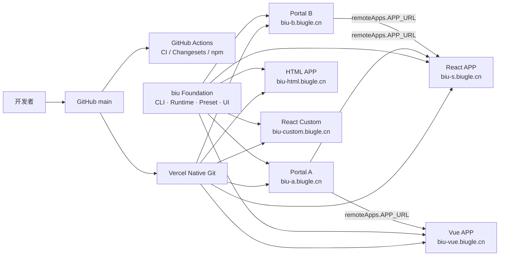
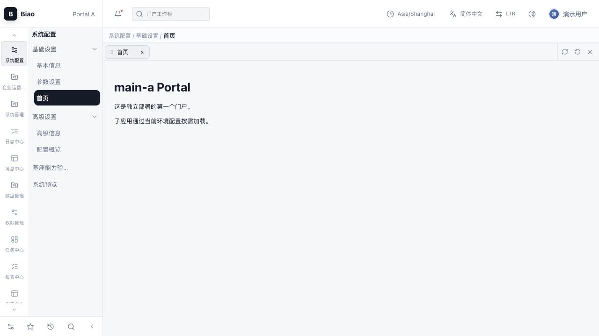
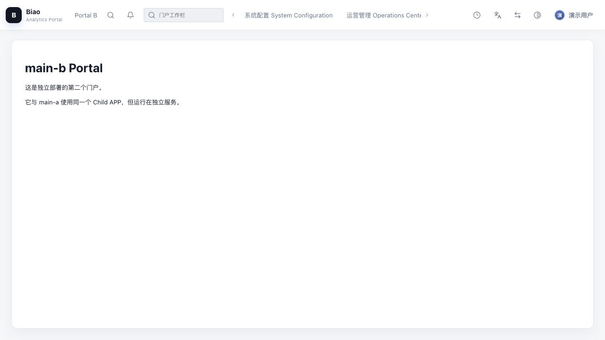
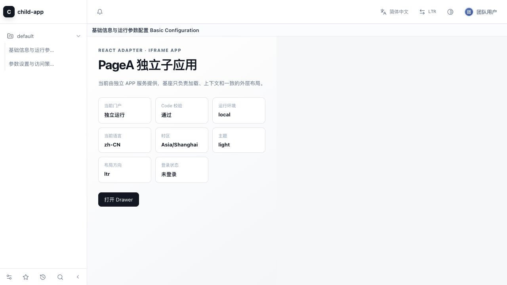
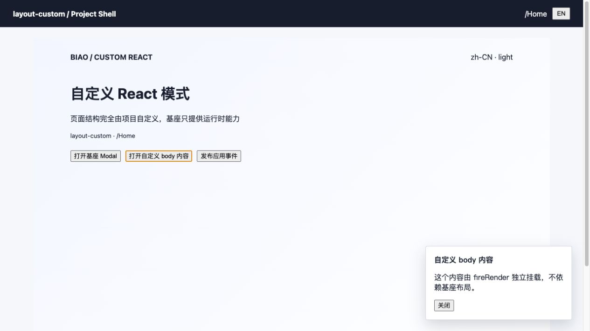
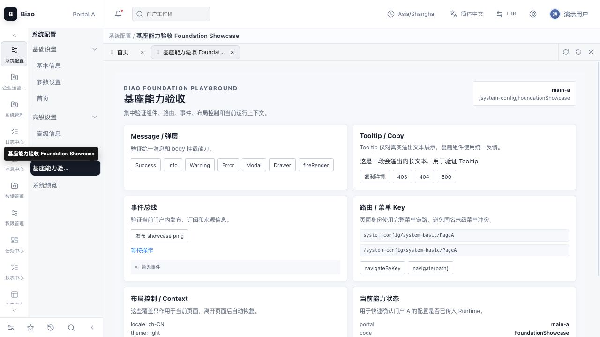
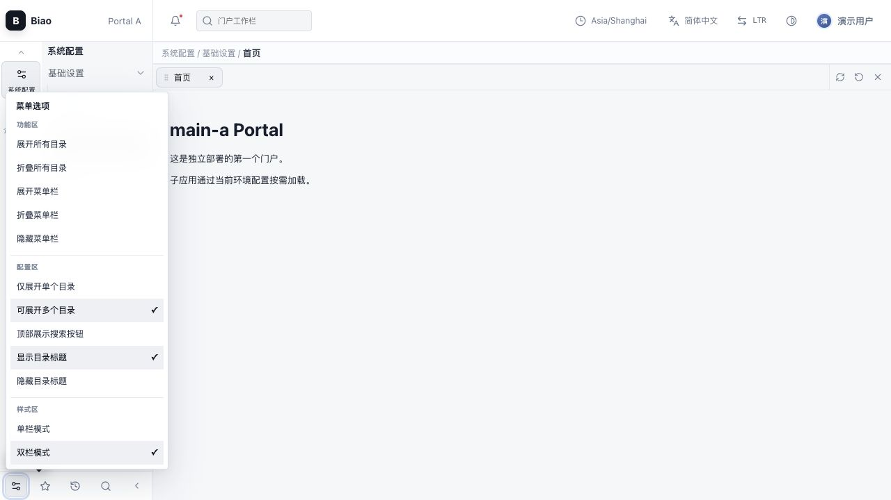
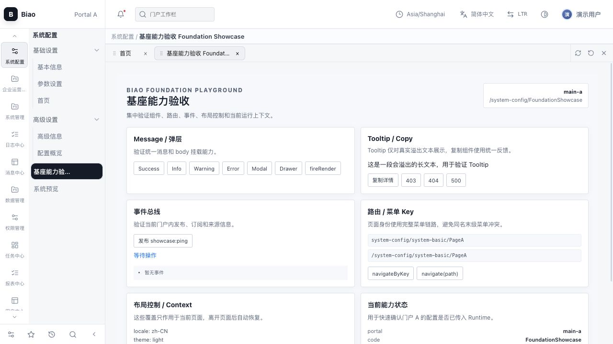

# biu


[English README](README.en.md)


> biu 是面向企业级 Portal、独立 APP 与 React Custom 的可拆包前端基座，用统一的 Shell、完整菜单路由、隔离状态、跨窗口协议和工程化 CLI 支撑多框架应用独立交付。

> biu biu 一下，一键生成企业级前端基座。

`biu` 基于 Node.js 22+、Rsbuild 和模块化 `@biugle/*` 包构建。它负责脚手架、编译筛选、Runtime、官方 Layout 和适配器契约；业务项目只维护页面、门户配置和本地路由。

## 生产 Demo 关系

生产 Demo 由同一套基座能力支撑。Portal 只维护菜单、路由和远程应用配置；独立 APP 各自构建、部署和回滚，不把子应用源码打进门户。



| Demo      | 地址                                                 | 作用                                    |
| --------- | ---------------------------------------------------- | --------------------------------------- |
| Portal A  | [biu-a.biugle.cn](https://biu-a.biugle.cn)           | Sidebar 门户、菜单、远程 APP 与基座能力 |
| Portal B  | [biu-b.biugle.cn](https://biu-b.biugle.cn)           | Topbar 门户、多目录导航和工具栏插槽     |
| React APP | [biu-s.biugle.cn](https://biu-s.biugle.cn)           | 独立 React 子应用                       |
| Vue APP   | [biu-vue.biugle.cn](https://biu-vue.biugle.cn)       | 独立 Vue 3 子应用                       |
| HTML APP  | [biu-html.biugle.cn](https://biu-html.biugle.cn)     | 原生 HTML 子应用                        |
| Custom    | [biu-custom.biugle.cn](https://biu-custom.biugle.cn) | 独立 React Custom 模式                  |

域名由 Vercel Project 绑定后生效，完整配置见 [Vercel 部署指南](docs/vercel-deploy.md)。

## 技术栈

- **Node.js 22+、pnpm、TypeScript**：统一运行时、依赖管理和类型边界。
- **Rsbuild / Rspack**：提供快速开发服务、生产构建、按页面拆分和内容 Hash 产物。
- **React 官方 Adapter**：基座 Layout、Custom 模式和 React 子应用使用 React；Vue 3、原生 HTML 以及其他框架通过 Adapter Contract 或 iframe 接入。
- **Zustand**：管理偏好、认证、菜单、收藏、最近使用和 Tabs 会话状态，并按门户与环境隔离存储。
- **@biugle/biu-router**：维护完整菜单链路、URL、权限过滤和导航查询，分享地址与菜单路径保持一致。
- **@biugle/biu-i18n**：框架无关的多语言核心，支持运行时切换、资源重新加载和合法值回退。
- **@biugle/biu-events / @biugle/biu-bridge**：分别提供同文档事件总线和带 Origin 校验的跨窗口通信协议。
- **@biugle/biu-ui / @biugle/biu-preset / @biugle/biu-runtime**：提供统一 Message、Tooltip、Modal、Drawer、`fire()`、Layout、生命周期和错误边界。
- **tsup、ESLint、Prettier、EditorConfig、Husky/lint-staged、Knip**：负责公共包构建、代码质量、统一编辑器格式、提交前门禁和未使用代码审计。
- **Changesets、GitHub Actions、Vercel**：负责版本记录、npm 发布、CI 门禁和 Demo 部署。

## 为什么选择 biu

企业通常同时维护新旧系统：有 React、Vue、原生 HTML，也有无法立即重写的历史项目。biu 把“接入方式”和“业务技术栈”解耦，Portal、独立 APP 和 React Custom 可以按项目实际情况选择：

- **兼容新旧项目**：React 使用官方 Adapter；Vue、HTML 和其他框架可以使用统一协议、Adapter Contract 或 iframe 渐进接入，不要求业务项目重写或统一成同一个 UI 框架。
- **四种交付模式**：Portal Sidebar、Portal Topbar、独立 APP preset 和 React Custom。Portal 与 APP 同级、独立启动、独立构建、独立部署，Custom 只使用基座能力，不被官方导航限制。
- **一套团队规范**：菜单、完整层级路由、权限筛选、Tabs、面包屑、状态、认证边界、主题、语言、时区、方向和跨窗口通信由同一套契约管理，避免每个项目自行约定一套规则。
- **统一交互体验**：Message、Tooltip、Modal、Drawer、`fire()`、加载态、错误边界和更新提示来自可复用公共包，子应用可以复用而不复制实现。
- **渐进式治理**：现有项目可以先作为独立 APP 或 iframe 接入，再逐步迁移到 Adapter；门户仍然只消费远程 APP 元数据，不把子应用源码混进自己的构建。
- **可审计、可发布**：CLI 统一生成、启动、菜单发现和构建；Knip 检查无用代码；Changesets 生成版本记录；CI 统一执行类型、测试、格式、场景和构建门禁。

因此，biu 不是把所有业务强行改成同一个框架，而是在保留项目自主性的前提下，把企业最容易失控的 Shell、协议和工程流程统一起来。

## 功能展示

下面的截图来自仓库 Demo，覆盖 Portal 双栏、顶部导航、独立子应用和 React Custom 四类使用方式；截图不包含真实地址、账号或业务数据。















## 核心模型

- Portal 和 APP 是同级、独立的 Biu 项目，各自启动、构建、端口和域名部署。
- Portal 只编译自己的 `PORTAL` 页面；菜单中的 `APP` 节点通过 `APP_ID` 查找当前环境配置的 `remoteApps.APP_URL`，加载独立 APP。
- Portal 和 APP 页面统一平级放在 `src/pages/<CODE>`；后端虚拟权限层级只用于菜单和权限，不映射成本地目录。
- 菜单入口统一放在根目录 `local-routes/index.ts`，其他路由文件由它集中导出；Portal 自有页面不再单独维护 `portal-pages`。
- 菜单接口返回哪些 Code，当前开发/构建就编译哪些页面；接口不可用时使用本地路由兜底；`--all` 用于排查和复现。
- 页面通过动态 `import()` 按需加载，生产产物按页面目录输出，入口统一为域名根路径 `dist/index.html`。
- `@biugle/biu-preset` 提供 Layout 和独立 CSS；业务项目只选择 preset，不复制基座 Layout。
- `@biugle/biu-i18n` 提供框架无关的语言核心，Runtime、CLI 和业务项目按契约使用；业务项目使用 `useBiuI18n().$t()` 或 `i18n.$t()`，不重复生成 i18n。
- `@biugle/biu-events` 提供框架无关的类型化同文档事件总线；iframe 跨窗口通信统一通过 `@biugle/biu-bridge` 协议包。
- `@biugle/biu-bridge` 提供框架无关的跨窗口协议、Origin 校验、消息 Schema 和身份脱敏；Runtime 只保留运行时配置适配。
- `@biugle/biu-ui` 提供可脱离 Layout 使用的 Message、Tooltip、Modal、Drawer 和 `fire()`；Runtime/Preset 内部只从该公开入口获取，不再维护第二套 UI 入口。
- `@biugle/biu-router` 提供菜单树、完整层级 URL、权限过滤和导航查询；业务项目可以直接复用而不依赖 Shell。
- `@biugle/biu-store` 提供偏好、认证、菜单交互和 Tabs 会话状态；不同门户的存储 scope 仍保持隔离。
- 官方 Adapter 为 React；原生 HTML 内置支持；Vue、Svelte、Angular 按同一 Adapter Contract 接入。
- 运行模式包括 Sidebar/Topbar Portal、带官方 preset 的独立 APP，以及只保留 Runtime 能力的 React `custom` 独立模式。

## 立即运行双门户 Demo

在工作区根目录执行，分别打开三个服务：

```bash
pnpm install
pnpm build
pnpm start --filter main-a -- --apps ../child-app,../vue-child # Portal + 独立 React/Vue APP 联调
pnpm start --filter main-b       # 独立 Portal
pnpm start --filter child-app   # 单独调试 React APP（可选）
pnpm start --filter vue-child    # 单独调试 Vue 3 APP（可选）
pnpm start --filter html-child   # 单独调试 HTML APP（可选）
pnpm start --filter layout-custom # React Custom 独立模式（可选）
```

`main-a` 和 `main-b` 位于 `examples/dev-demo/apps/`，是两个同级、独立部署的门户；两者都通过各自环境文件中的 `remoteApps.APP_URL` 加载独立 APP。Demo 同时包含 React `child-app` 和 Vue 3 `vue-child`，用于验证不同前端框架共用同一套基座协议。门户服务根路径就是 `/`，不存在 `/portals/...` 前缀。

未配置 `dev.port` 时，CLI 会从 Portal `9001–9999`、APP `8001–8888` 中按递增顺序选择空闲端口；Demo 中的端口只是默认起点，实际端口以 CLI 启动日志为准。在 `biu.config.ts` 配置 `dev.port` 或通过 `--port` 即可覆盖。

单独验证任一项目：

```bash
pnpm --filter child-app build
pnpm --filter main-a build
pnpm --filter main-b build
pnpm --filter html-child build
```

门户联调时可由门户命令启动独立子应用：

```bash
pnpm start --filter main-a -- --apps ../child-app,../vue-child
```

这只是本地进程编排；生产部署仍然是 Portal 和 APP 两份独立 `dist`、独立域名。

## 创建项目

```bash
biu create my-portal --type PORTAL
biu create my-app --type APP
biu init # 交互式选择模式、数量、认证、菜单来源和 Portal 插槽
```

Portal 和 APP 模板都生成 `src/pages` 与根目录 `local-routes/index.ts`，不生成 `src/apps`、`portal-pages`、项目级 `src/i18n` 或 `src/shared`。生成项目后在项目目录执行 `pnpm start` 即可运行。

## 开发、构建与发版

推荐的日常闭环如下，所有命令都可以在仓库根目录执行：

```text
biu init / biu create
        ↓
pnpm install
        ↓
pnpm start --filter <portal-or-app>
        ↓
pnpm check && pnpm test
        ↓
pnpm lint && pnpm format:check && pnpm audit:unused
        ↓
pnpm build:demo:all
        ↓
pnpm changeset
        ↓
pnpm version-packages
        ↓
pnpm release
```

本地开发时，CLI 会发现项目配置、菜单和页面，并生成 `.biu/generated` 临时入口；基座包会同步到项目级 `.biu/foundation` 快照。开发者只维护 `biu.config.ts`、环境配置、`local-routes/index.ts` 和业务页面，不需要手写 Rsbuild 入口或跨应用编排脚本。`biu init` 会引导选择 Portal/APP/Custom 模式、项目数量、认证、菜单来源和 Portal 插槽；已有项目可以直接使用 `biu create` 或按 Adapter Contract 接入。

构建时，CLI 按菜单和权限白名单生成页面 Registry，Rsbuild/Rspack 输出 `dist/index.html`、页面 chunk、静态资源和 manifest。Portal 与 APP 分别构建、部署和回滚；内容 Hash 负责静态资源缓存，HTML/manifest 使用短缓存或 `no-cache`，Runtime 在首次加载和用户操作时检查一次 buildId，不轮询也不强制刷新。

合并前至少执行：

```bash
pnpm check                 # 公共包构建与类型检查
pnpm test                  # 公共包单测
pnpm lint                  # Demo 与工作区代码质量
pnpm format:check          # 格式门禁
pnpm audit:unused          # Knip 未使用文件、依赖、导出和引用审计
pnpm verify:scenarios      # CLI 100 个场景
pnpm build:demo:all        # 默认验收 Demo
```

发版使用 Changesets，不手工修改受影响包的版本号或 CHANGELOG：

```bash
pnpm changeset             # 描述变更和 semver 级别
pnpm version-packages      # 更新版本、CHANGELOG 和锁文件
pnpm release               # 审计、构建、测试并发布受影响包
```

当前发布 10 个可复用包：`@biugle/biu-cli`、`@biugle/biu-i18n`、`@biugle/biu-events`、`@biugle/biu-bridge`、`@biugle/biu-router`、`@biugle/biu-store`、`@biugle/biu-ui`、`@biugle/biu-runtime`、`@biugle/biu-preset` 和 `@biugle/biu-adapter-react`。Demo 项目是私有 workspace，不发布到 npm。GitHub Actions 会在 Pull Request 执行 CI 门禁，Release workflow 根据 Changesets 创建版本 PR，合并后发布 npm；Demo 使用 Vercel 原生 Git 部署，Actions 只负责构建验收产物。

用户升级时只需要按项目实际使用的包更新版本，例如：

```bash
pnpm update @biugle/biu-cli @biugle/biu-runtime @biugle/biu-preset @biugle/biu-router @biugle/biu-store
```

版本更新与部署后的 buildId 检查是两条独立链路：npm 版本解决代码依赖升级，更新清单解决已部署资源提示，二者都不会把 Token、Cookie 或用户数据放入前端清单。

## 文档

- [文档中心](docs/README.md) / [Documentation](docs/README.en.md)
- [设计说明](docs/design.md)：架构边界、数据协议、编译与运行时流程。
- [架构复审](docs/architecture-review.md)：企业级模块边界、安全责任、扩展策略和最终评分。
- [使用文档](docs/usage.md)：创建、启动、路由、Layout、环境和框架接入。
- [开发文档](docs/development.md)：代码组织、调试、测试和发布约定。
- [Adapter 手册](docs/adapters.md)：React、HTML、Vue、Svelte、Angular 接入方式。
- [生产交付检查清单](docs/production-checklist.md)：安全、构建、部署和回滚验收。
- [Demo 说明](examples/dev-demo/apps/main-a/README.md)：双门户与独立 APP 的联调示例。
- [实现对照表](docs/implementation-matrix.md)：交付验收 checklist。
- [干净验收说明](docs/clean-acceptance.md)：清理生成物与最终回归顺序。
- [贡献指南](CONTRIBUTING.md)：开发、审查和提交约定。
- [安全策略](SECURITY.md)：敏感数据边界和漏洞报告方式。
- [发布与 Vercel](docs/release.md)：Changesets、GitHub Actions 自动发版和缓存策略。
- [Vercel 部署指南](docs/vercel-deploy.md)：六个 Demo 的原生 Git 部署、域名和 DNS 配置。
- [最终交付审计](docs/final-delivery-review.md)：回归结果、评分、已完成项、TODO 和首次提交前配置。

## 工作区脚本

```bash
pnpm check
pnpm test
pnpm build
pnpm build:demo:all
pnpm audit:unused
pnpm verify
pnpm verify:scenarios
```

启动统一使用 `pnpm start --filter <portal-or-app>`；底层 filter 编排由 `@biugle/biu-cli` 的 `biu start` 提供，业务项目不直接维护 Node 启动脚本。

所有页面、菜单和权限都必须经过后端最终鉴权；前端 Code 只负责定位、展示和加载边界。

分享 URL 使用完整菜单 Code 层级（例如 `/system-config/system-basic/PageA`），权限与审计使用对应完整菜单 Key；重复 Code 必须通过 `navigateByKey` 定位，不能依赖最后一级 Code。

## 开源和 Demo 部署

仓库包含 MIT License、贡献指南、安全策略、行为准则以及 Issue/PR 模板。GitHub Actions 负责 CI 与 npm 发版，Vercel 原生 Git 负责六个 Demo 部署；详细步骤分别见 [发布与 Vercel](docs/release.md) 和 [Vercel 部署指南](docs/vercel-deploy.md)。

`docs/screenshots/portal-layouts.svg` 是不含本地地址和用户数据的布局示意图；真实验收截图建议在目标部署环境中重新生成，不把本地浏览器状态提交到仓库。
